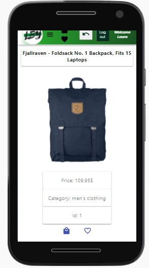
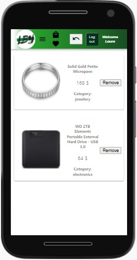
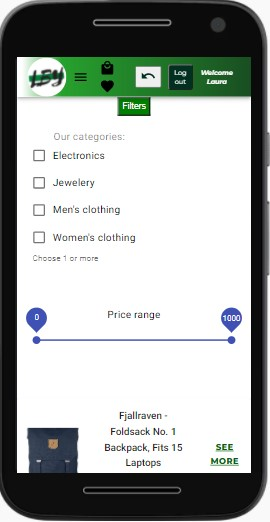
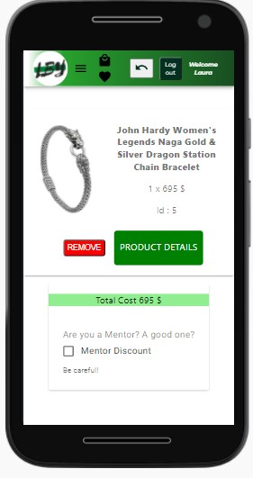

# LBy-shop - E-Commerce app project
 Responsive design available for mobile App

# Characteristics
- ReactJs
- BackEnd: Firebase Database
- Rest Api: Fake shop Api
- Upload Pictures: Cloudinary

# Description
React app created using an e-commerce API, to fetch and display products. Differents filters and features allow the user to select the categories of products he prefers, create his list of favorite products and add them to the shopping cart. Firebase and Firestore Databases are used to manage user and products collections.

## Screen shots

<table style="padding:10px">
 <tr>
 <th>Product Details</th>
   <th>Page with all favorites</th>
   <th>Products filters</th>
   <th>Shopping Cart</th>
 </tr>
  <tr>
    <td> 
         </td>
      
 <td></td>
   <td></td>
   <td></td>
    

  </tr>
</table>

